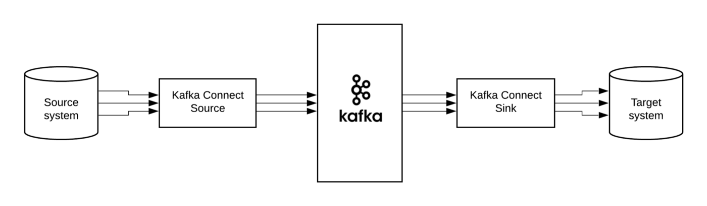

# learn-kafka

> 아파치 카프카 애플케이션 프로그래밍 with 자바를 읽고 정리 및 실습을 위한 repo


## 1장. 들어가며

### 로그 (모든 소프트웨어 엔지니어가 실시간 데이터의 통합 추상화에 대해 알아야 할 사항)
- https://engineering.linkedin.com/distributed-systems/log-what-every-software-engineer-should-know-about-real-time-datas-unifying

<hr>

# 3장. 카프카 기본 개념 설명

## 3.1 카프카 브로커, 클러스터, 주키퍼

### **카프카 브로커란?**
> 카프카 클라이언트와 데이터를 주고 받기 위해 사용하는 주체이자, 데이터를 분산 저장하여 장애가 발생하더라도 안전하게 사용할 수 있도록 도와주는 애플리케이션이다.

- 하나의 서버에는 한 개의 카프카 브로커 프로세스가 실행된다.
- 카프카 브로커 서버 1대로도 기본 기능이 실행되지만, 데이터를 안전하게 보관하고 처리하 위해 3대 이상의 브로커 서버를 1개의 클러스터로 묶어서 운영한다.
- 카프카 클러스터로 묶인 브로커들은 프로듀서가 보낸 데이터를 안전하게 분산 저장하고 복제하는 역할을 수행한다.

#### 데이터 저장과 전송 

- 카프카는 데이터 저장을 위해 파일 시스템을 사용하고 파일 시스템의 읽기 성능을 위해 페이지 캐시(page cache)를 사용하여 디스크 입출력 속도를 높였다.
  - 페이지 캐시란 OS 에서 파일 입출력의 성능 향상을 위해 만들어 놓은 메모리 영역을 뜻함
  - 한번 읽은 파일의 내용은 메모리의 페이지 캐시 영역에 저장

#### 데이터 복제와 싱크

- 카프카의 데이터 복제는 파티션 단위로 이루어지며, 토픽을 생성할 때 파티션의 복제 개수도 같이 설정한다.
- 복제된 파티션은 리더와 팔로워로 구성되고 프로듀서 또는 컨슈머와 직접 통신하는 파티션을 리더, 나머지 복제 데이터를 가지고 있는 파티션을 팔로워라 한다.

#### 컨트롤러
- 클러스터의 다수 브로커 중 한 대가 컨트롤러의 역할을 한다. 컨트롤러는 다른 브로커들의 상태를 체크하고 브로커가 클러스터에서 빠지는 경우 해당 브로커에 존재하는 리더 파티션을 재분배 한다.

#### 데이터 삭제
- 카프카는 다른 메시징 플랫폼과 다르게 컨슈머가 데이터를 가져가더라도 토픽의 데이터는 삭제되지 않는다.
  - 컨슈머나 프로듀서가 데이터 삭제를 요청할 수도 없다.
  - 오직 브로커만이 데이터를 삭제할 수 있다.
- 데이터 삭제는 파일 단위로 이루어지는데 <b>로그 세그먼트</b>라 부른다.

#### 컨슈머 오프셋 저장

- 컨슈머 그룹은 파티션의 어느 레코드까지 가져갔는지 확인을 위해 오프셋을 커밋한다. (__consumer_offsets 토픽에 저장)
- 저장된 오프셋을 토대로 컨슈머 그룹은 다음 레코드를 가져가서 처리한다.

#### 코디네이터(coordinator)

>클러스터의 다수 브로커 중 한 대는 코디네이터의 역항을 수행한다.
- 코디네이터는 컨슈머 그룹의 상태를 체크하고 파티션을 컨슈머와 매칭되도록 분배하는 역할을 한다.
- 컨슈머가 컨슈머 그룹에서 빠지면 매칭되지 않은 파티션을 정상 동작하는 커슈머로 할당하여 끊임없이 데이터가 처리 되도록(일을 하도록) 도와준다.
  - 이러한 과정을 <b>리밸런스(Rebalance)</b>라 부른다.

<hr>

### **주키퍼란?**

> 주키퍼는 카프카의 메타데이터를 관리하는 데에 사용된다.
> [주키퍼 쉘 명령어](https://zookeeper.apache.org/doc/current/zookeeperStarted.html)

- 카프카 클러스터로 묶인 브로커들은 동일한 경로의 주커퍼 경로로 선언해야 같은 카프카 브로커 묶임이 된다.
- 클러스터를 여러 개로 운영한다면 한 개의 주키퍼에 다수의 카프카 클러스터를 연결해서 사용할 수도 있다.

#### znode

- 주키퍼에서 사용하는 데이터 저장 단위이다.
- 파일 시스템처럼 znode간에 계층 구조를 가진다.
  - 1개의 znode는 n개의 하위 znode가 존재하고 계속해서 tree 구조로 znode가 존재할 수 있다.
- 2개 이상의 카프카 클러스터를 구축할 때는 root znode가 아닌 한 단계 아래의 znode를 카프카 브로커 옵션으로 지정해야 한다.
  - 파이프라인 : zookeeper.connect=localhost:2181/pipeline 
  - 실시간 추천 시스템 : zookeeper.connect=localhost:2181/recommend
  
<hr>

## 3.2 토픽과 파티션

### **토픽**

> 토픽은 카프카에서 데이터를 구분하기 위해 사용하는 단위이다. 토픽은 1개 이상의 파티션을 소유하고 있다.

#### 의미있는 토픽 이름
토픽의 이름은 데이터의 얼굴이다. 최소한 토픽 이름을 통해 어떤 개발환경에서 사용되는 것인지 판단 가능해야 하고 어떤 애플리케이션에서 어떤 데이터 타입인지 유추할 수 있어야 한다.

kebab-case나 snake_case가 권장되며 특수문자를 조합하여 사용하면 좋다.

##### 예시)
```
<환경>.<팀-명>.<애플리케이션-명>.<메시지-타입>
  dev.marketing-team.sms-platform.json
<프로젝트-명>.<서비스-명>.<환경>.<이벤트-명>
  commerce.payment.dev.notification
<환경>.<서비스-명>.<JIRA-번호>.<메시지-타입>
  dev.email-sender.jira-1234.email-vo-custom
<카프카-클러스터-명>.<환경>.<서비스-명>.<메시지-타입>
  aws-kafka.live.marketing-platform.json
```


중요한 것은 토픽 이름에 대한 규칙을 사전에 정의하고 구성원들이 그 규칙을 잘 따르는 것이다.

<b>카프카는 토픽 이름 변경을 지원하지 않으므로 이름을 변경하기 위해서는 삭제 후 다시 생성해야 한다.</b>

<hr>

### **파티션**

> 파티션에는 프로듀서가 보낸 데이터들이 들어가 저장되는데 이 데이터를 레코드(record) 라고 부른다.

- 파티션은 자료구조에서 접하는 큐와 비슷한 구조이지만, 데이터를 가져가더라도 레코드를 삭제하지 않는다.
  - 이 특징으로 인해 토픽의 레코드는 다양한 목적을 가진 여러 컨슈머 그룹들이 토픽의 데이터를 여러 번 가져갈 수 있다.
- 파티션은 카프카의 병렬처리의 핵심으로써 컨슈머 그룹이 레코드를 병렬로 처리할 수 있도록 매칭된다.

<hr>

## 3.3 레코드

### **레코드**

> 레코드는 타임스탬프, 메시지 키, 메시지 값, 오프셋, 헤더로 구성되어 있다. 프로듀서가 생성한 레코드가 브로커로 전송되면 오프셋과 타임스탬프가 지정되어 저장된다. 브로커에 한번 적재된 레코드는 수정 불가능하고 로그 리텐션 기간 또는 옹량에 따라서만 삭제된다.

```
=======
오프셋
-------
메시지 키
-------
메시지 값
=======
레코드

```

<hr>

#### 타임스탬프

- 프로듀서에서 해당 레코드가 생성된 시점(CreateTime)의 유닉스 타임이 설정된다.
- 프로듀서가 레코드를 생성할 때 임의의 타임스탬프 값을 설정할 수 있다.
- 토픽 설정에 따라 브로커에 적재된 시간(LogAppendTime)으로 설정될 수도 있다.

<hr>

#### 메시지 키

메시지 값을 순서대로 처리하거나 메시지 값의 종류를 나타내기 위해 사용한다. 

<b>메시지 키를 사용하면 프로듀서가 토픽에 레코드를 전송할 때 메시지 키의 해시값을 토대로 파티션을 지정하게 된다.</b>
즉, 동일한 메시지 키라면 동일 파티션에 적재된다.

다만, 어느 파티션에 지정될지 알 수 없고 파티션 개수가 변경되면 메시지 키와 파티션 매칭이 달라질 수 있다.
메시지 키를 선언하지 않으면 null로 설정되며 null로 설정된 레코드는 프로듀서 기본 설정 파티셔너에 따라서 파티션에 분배되어 적재된다.

<hr>

#### 메시지 값

실질적으로 처리할 데이터가 들어 있다.

- 메시지 키와 값은 직렬화되어 브로커로 전송되기 때문에 컨슈머가 이용할 때는 직렬화한 형태와 동일한 형태로 역직렬화를 수행해야 한다.
- 레코드의 오프셋은 0 이상의 숫자로 이루어져 있다.
  - 오프셋은 직접 지정할 수 없고 브로커에 저장될 때 이전에 전송된 레코드의 +1 값으로 생성된다.
- 오프셋을 사용하면 컨슈머 그룹으로 이루어진 카프카 컨슈머들이 파티션의 데이터를 어디까지 가져갔는지 명확히 알 수 있다.

<hr>

#### 헤더

레코드의 추가적인 정보를 담는 메타데이터 저장소 용도로 사용한다. 헤더는 키/값 형태로 데이터를 추가하여 레코드의 속성(스키마 버전 등)을 저장하여 컨슈머에서 참조할 수 있다.

<hr>

## 3.4 카프카 클라이언트

> 카프카 클러스터에 명령을 내리거나 데이터를 송수신하기 위해 카프카 클라이언트 라이브러리는 카프카 프로듀서, 컨슈머, 어드민 클라이언트를 제공하는 카프카 클라이언트를 사용하여 애플리케이션을 개발한다.

### **프로듀서 API**

카프카의 데이터 시작점이며 프로듀서 애플리케이션은 카프카에 필요한 데이터를 선언하고 브로커의 특정 토픽의 파티션에 전송한다.

- 프로듀서는 데이터를 전송할 때 리더 파티션을 가지고 있는 카프카 브로커와 직접 통신한다.
- 프로듀서는 데이터를 직렬화하여 카프카 브로커로 보낸다.
- 자바의 primitive type, reference type 뿐 아니라 동영상, 이미지 같은 바이너리 데이터도 전송 가능하다.

#### 간단의 형태의 프로듀서
```java
public class SimpleProducer {
  private final static Logger logger = LoggerFactory.getLogger(SimpleProducer.class);
  private final static String TOPIC_NAME = "test";

  //전송할 카프카 클러스터 정보
  private final static String BOOTSTRAP_SERVERS = "my-kafka:9092";

  public static void main(String[] args) {
    //1.필수 옵션과 선택 옵션을 설정한다.
    Properties properties = new Properties();
    properties.put(ProducerConfig.BOOTSTRAP_SERVERS_CONFIG, BOOTSTRAP_SERVERS);
    properties.put(ProducerConfig.KEY_SERIALIZER_CLASS_CONFIG, StringSerializer.class.getName());
    properties.put(ProducerConfig.VALUE_SERIALIZER_CLASS_CONFIG, StringSerializer.class.getName());

    //2.설정 값을 프로듀서에 인자로 넘긴다.
    KafkaProducer<String, String> producer = new KafkaProducer<>(properties);

    String messageValue = "testMessage";
    //3.카프카 브로커로 데이터를 보내기 위해 프로듀서 레코드를 생성한다.
    //메시지 키를 담지 않았기 때문에 null로 설정된다.
    //ProducerRecord(String topic, Integer partition, Long timestamp, K key, V value, Iterable<Header> headers)
    ProducerRecord<String, String> record = new ProducerRecord<>(TOPIC_NAME, messageValue);

    //즉각 전송이 아닌 레코드를 프로듀서 내부에 가지고 있다가 배치 형태로 묶어서 브로커에 전송한다.
    producer.send(record);
    /*
     * 1. 카프카 옵션 출력
     * 2. 카프카 클라이언트 버전 출력
     * 3. 전송한 레코드 출력
     * */
    logger.info("{}", record);
    //프로듀서 내부 버퍼에 가지고 있는 레코드 목록을 브로커로 전송한다.
    producer.flush();
    //프로듀서 리소스 종료
    producer.close();
  }
}
```

<hr>

#### 프로듀서 중요 개념

- 프로듀서는 카프카 브로커로 데이터를 전송할 때 내부적으로 파티셔너, 배치 생성 단계를 거친다.
- ProductRecord 생성시 파티션 번호 지정, 타임스탬프 설정, 메시지 키를 설정할 수도 있다. 
  - 레코드의 타임스탬프는 카프카 브로커에 저장될 때 브로커 시간을 기준으로 설정되지만 설정을 할 수도 있다.
- KafkaProducer.send()를 호출하면 ProductRecord는 파티셔너(partitioner)에서 토픽의 어느 파티션으로 전송될 것인지 정해진다.
  - 따로 설정을 주지 않으면 DefaultPartitioner로 설정된다.
- 파티셔너에 의해 구분된 레코드는 데이터 전송 전에 어큐뮬레이터(accumulator)에 데이터를 버퍼로 쌓아놓고 발송한다.
  - 버퍼에 쌓인 데이터는 배치로 묶어서 전송함으로써 카프카의 프로듀서 처리량을 향상시키는데 도움을 준다.
- 프로듀서 API를 사용하면 'UniformStickyPartitioner'와 'RoundRobinPartitioner' 2개 파티션을 제공한다.
  - 메시지 키가 있을 때는 메시지 키의 해시값과 파티션을 매칭하여 데이터를 전송한다는 점이 동일하다.
  - 메시지 키가 없다면 파티션에 최대한 동일하게 분배하는 로직이 들어 있는데 UniformStickyPartitioner은 RoundRobinPartitioner의 단점을 개선하였다.

##### **UniformStickyPartitioner**
- 프로듀서 동작에 특화되어 높은 처리량과 낮은 리소스 사용률을 가진다.
- 어큐뮬레이터에서 데이터가 배치로 모두 묶일 때 까지 기다렸다가 배치로 묶인 데이터는 모두 동일한 파티션으로 전송한다.


##### **RoundRobinPartitioner**
- ProductRecord가 들어오는 대로 파티션을 순회하며 전송하기 때문에 배치로 묶이는 빈도가 적다.

<hr>

추가적으로 카프카 프로듀서는 브로커로 전송 시 압축 방식을 정할 수 있는데 압축 옵션으로 gzip, snappy, lz4, zstd 를 지원한다.
압축을 하면 데이터 전송시 네트워크 처리량에 이점을 가지지만, 압축을 푸는 데에 CPU 또는 메모리 리소스를 사용하므로 사용환경에 따라 적절한 옵션 사용이 권장된다.

또한, 프로듀서에서 압축한 메시지는 컨슈머 애플리케이션이 압축을 풀게 되는데 이때도 컨슈머 애플리케이션 리소스가 사용되는 점을 주의해야 한다.

<hr>

#### 프로듀서 주요 옵션

- 필수
  - bootstrap.servers (카프카 클러스터에 속한 브로커 정보)
  - key.serializer (레코드 메시지 키 직렬화)
  - value.serializer (레코드 메시지 값 직렬화)
- 선택 (주요)
  - acks (성공 확인 LEVEL)
  - buffer.memory (버퍼 메모리)
  - retries (실패시 재시도 횟수)
  - batch.size (배치 사이즈)
  - linger.ms (배치 전송 시간)
  - partitioner.class (파티셔너 지정)
  - enable.idempotence (멱등성)
  - transactional.id (트래잭션 묶기)

[카프카 프로듀서 옵션](https://kafka.apache.org/documentation/#producerconfigs)

<hr>

### **컨슈머 API**

> 프로듀서가 전송한 데이터는 카프카 브로커에 적재되고 컨슈머는 적재된 데이터를 사용하기 위해 브로커로부터 데이터를 가져와 필요한 처리를 한다.

#### 컨슈머 중요 개념

토픽의 파티션으로부터 데이터를 가져가기 위해 컨슈머를 운영하는 방법은 크게 2가지이다.
- 1개 이상의 컨슈머로 이루어진 컨슈머 그룹을 운영
  - 컨슈머 그룹으로 묶인 컨슈머들은 토픽의 1개 이상 파티션들에 할당되어 데이터를 가져갈 수 있다.
  - 컨슈머 그룹으로 묶은 컨슈머가 토픽을 구독해서 데이터를 가져갈 때, 1개의 파티션은 최대 1개의 컨슈머에 할당 가능하다. 그리고 1개 컨슈머는 여러 개의 파티션에 할당될 수 있다.
  - 컨슈머 그룹의 컨슈머 수는 가져가고자 하는 토픽의 파티션 개수보다 같거나 작아야 한다.
    - 만약 컨슈머 그룹(컨슈머 4)에서 토픽(파티션 3) 할당하면 1개의 컨슈머는 파티션을 할당받지 못하고 유휴 상태로 남아 스레드만 차지하게 된다.
  - 컨슈머 그룹은 다른 컨슈머 그룹과 격리되는 특성이 있다.
    - 데이터를 수집하는 목적에 따라 컨슈머 그룹을 세분화할 필요가 있다.
- 토픽의 특정 파티션만 구독하는 컨슈머를 운영

<hr>

##### 컨슈머 그룹 리밸런싱

> 컨슈머 그룹 중 일부 컨슈머가 제외(장애)되거나 추가되면 컨슈머에 할당된 파티션의 소유권이 옮겨진다. 이러한 과정을 리밸런싱이라고 부른다.

- 리밸런싱은 컨슈머가 데이터를 처리하는 도중에 언제든지 발생할 수 있으므로 대응 코드를 작성해야 한다.
  - consumer_offsets 커밋을 정상적으로 처리했는지 검증
- 리밸런싱 중에 파티션의 소유권을 컨슈머로 재할당하는 과정에서 해당 컨슈머는 데이터를 읽을 수 없다. (자주 일어나면 X)
- 그룹 조정자 (group coordinator)는 리밸런싱을 발동시키는 역할을 한다.
  - 컨슈머 그룹의 컨슈마가 추가, 제외될 때를 감지한다.

<hr>

- 비명시 오프셋 커밋은 리밸선싱 또는 컨슈머 강제종료 발생 시 데이터 중복 또는 유실 가능성이 있다.
- 명시적 오프셋 커밋은 poll() 메소드 호출 이후에 반환받은 데이터의 처리가 완료되고 commitSync() 메소드를 호출하면 된다.
  - commitSync()는 poll()을 통해 반환된 레코드의 가장 마지막 오프셋을 기준으로 커밋을 수행한다.
  - commitSync()는 브로커에 커밋을 요청을 하고 커밋이 정상 처리되었는지 응답하기까지 기다리는데 이는 컨슈머의 처리량에 영향을 미친다.
    - 이를 해결하기 위해 commitAsync()를 사용한다. 하지만 비동기 커밋은 실패했을 경우 데이터의 순서를 보장하지 않으며 중복처리에 대한 문제를 가진다.


#### 컨슈머 내부 구조
> 컨슈머는 poll()을 통해 레코드들을 반환받지만 poll()을 호출하는 시점에 클러스터에서 데이터를 가져오는 것은 아니다.
> 컨슈머 애플리케이션을 실행하면 내부에서 Fetcher 인스턴스가 생성되어 poll() 메소드를 호출하기 전에 미리 레코드들을 내부 큐로 가져온다. 이후에 사용자가 명시적으로 poll()을 호출하면 컨슈머는 내부 큐에 있는 레코드를 반환받아 처리한다.

#### 컨슈머 주요 옵션

- 필수
  - bootstrap.servers (카프카 클러스터에 속한 브로커 정보)
  - key.deserializer (레코드 메시지 키 역직렬화)
  - value.deserializer (레코드 메시지 값 역직렬화)
- 선택 (주요)
  - group.id (컨슈머 그룹아이디 지정)
    - subscribe() 로 토픽을 구독하여 사용한다면 필수
  - auto.offset.reset (컨슈머 그룹이 어느 오프셋을 읽을지 선택)
  - enable.auto.commit (자동 커밋 or 수동 커밋)
  - auto.commit.interval.ms (자동커밋 오프셋 커밋 시간 간격)
  - max.poll.records (poll()을 통해 반환되는 레코드 수)
  - session.timeout.ms (컨슈머가 브로커와 연결이 끊기는 시간)
    - 시간 내 하트비트를 전송하지 않으면 컨슈머에 이슈가 발생했다고 가정하고 리밸런싱을 시작
  - heartbeat.interval.ms (하트비트 시간)
  - max.poll.interval.ms (poll() 호출하는 간격의 최대 시간)
    - 시간 내 데이터 처리가 안된다면 비정상으로 판단하고 리밸런싱
  - isolation.level (트래잭션 프로듀서가 레코드를 트랜잭션 단위로 보낼 경우 사용)

[카프카 전체 옵션](https://kafka.apache.org/documentation/#consumerconfigs)

<hr>


### **어드민 API**

카프카에 설정된 내부 옵션을 확인하는 가장 확실한 방법은 브로커 중 한 대에 접속하거나, 카프카 CLI를 통한 방법이 있지만 번거롭거나 일회성에 그친다.

이런 문제를 위해 카프카 클라이언트에서는 내부 옵션을 설정하고 조회하기 위해 AdminClient 클래스를 제공한다. AdminClient를 활용하면 클러스터의 옵션과 관련된 부분을 자동화 할 수 있다.

예시
- 카프카 컨슈머를 멀티 스레드로 생성할 때, 구독하는 토픽의 파티션 개수만큼 스레드를 생성하고 싶을 때 스레드 생성 전에 해당 토픽의 파티션 개수를 어드민 API를 통해 가져올 수 있다.
- AdminClient 클래스로 구현한 웹 대시보드를 통해 ACL(Access Control List)이 적용된 클러스터의 리소스 접근 권한 규칙 추가를 할 수 있다.
- 특정 토픽의 데이터양이 늘어남을 감지하고 AdminClient 클래스로 해당 토픽의 파티션을 늘릴 수 있다.


## 3.5 카프카 스트림즈
> 카프카 스트림즈는 토픽에 적재된 데이터를 상태기반(stateful) 또는 비상태기반(stateless)으로 실시간 변환하여 다른 토픽에 적재하는 라이브러리이다.
== 추후 정리
<hr>


## 3.6 카프카 커넥트

> 카프카 커넥트는 데이터 파이프라인 생성 시 **반복 작업**을 줄이고 효율적인 전송을 이루기 위한 애플리케이션이다. 
>
> 커넥트는 특정한 작업 형태를 템플릿으로 만들어놓은 커넥터를 실행함으로써 반복 작업을 줄일 수 있다. 

- 파이프라인 생성 시 자주 반복되는 값들(토픽 이름, 파일 이름, 테이블 이름 등)을 파라미터로 받는 커넥터를 코드로 작성한다.
- 커넥터는 각 커넥터가 가진 고유한 설정값을 입력받아서 데이터를 처리한다.
  - 파일의 데이터를 토픽으로 보내는 커넥터가 있다면 파일이 존재하는 디렉토리의 위치, 파일 이름을 설정
- 커넥터는 프로듀서 역할을 하는 **소스 커넥터**와 컨슈머 역할을 하는 **싱크 커넥터**로 나뉜다.  
- 소스 커넥터는 파일의 데이터를 토픽으로 전송하고 싱크 커넥터는 토픽의 데이터를 파일로 저장하는 역할을 한다.(MySQL, S3, MongoDB이 대표적인 싱크, 소스 애플리케이션)
- 태스크는 커넥터에 종속되는 개념으로 실질적인 데이터 처리를 한다.
  - 데이터 정상 처리를 확인하기 위해서 각 태스크의 상태르를 확인해야 한다.
- 컨버터는 데이터 처리를 하기 전에 스키마를 변경하도록 도와준다. 
  - JsonConverter, StringConverter, ByteConverter를 지원하고 필요하다면 커스텀하여 사용할 수 있다.
- 트랜스폼은 데이터 처리 시 각 메시지 단위로 데이터를 간단하게 변환하기 위한 용도로 사용된다.
  - JSON 데이터를 커넥터에서 사용할 때 트랜스폼을 사용하면 특정 키를 삭제 또는 추가할 수 있다. (기본제공:Cast, Drop, ExtractField)



[출처:https://medium.com/walmartglobaltech/kafka-connect-overview-a84782d96ab5]

#### 커넥트 실행 방법

**단일모드 커넥트**
단일 애플리케이션으로 실행되며 커넥터를 정의하는 파일을 작성하고 해당 파일을 참조하는 단일 모드 커넥트를 실행함으로써 파이프라인을 생성할 수 있다.

- 1개 프로세스만 실행되는 특징이 있다.
  - 단일 프로세스로 실행되기 때문에 고가용성 구성이 되지 않아서 단일 장애점(SPOF)이 될 수 있다.
- 단일 모드 커넥트 파이프라인은 주로 개발환경이나 중요도가 낮은 파이프라인을 운영할 때 사용한다.

**분산 모드 커넥트**
- 2대 이상의 서버에서 클러스터 형태로 운영함으로써 단일 모드 커넥트 대비 안전한 운영을 할 수 있다는 장점이 있다.
- 데이터 처리량의 변화에도 유연하게 대응할 수 있다.


````http request
### FileStreamSourceConnector 실행
POST http://localhost:8083/connectors
Content-Type: application/json

{
  "name" : "local-file-source",
  "config" : {
    "connector.class": "org.apache.kafka.connect.file.FileStreamSourceConnector",
    "file": "/tmp/test.txt",
    "task.max" : "1",
    "topic": "connect-test"
  }
}


### 커넥터 정상 작동 확인
GET http://localhost:8083/connectors/local-file-source/status
accept:application/json

### 커넥터 종료
DELETE http://localhost:8083/connectors/local-file-source

### 실행중인 커넥터 목록
GET http://localhost:8083/connectors
````


### 3.6.1 소스 커넥터

> 소스 애플리케이션 또는 소스 파일로부터 데이터를 가져와 토픽으로 넣는 역할을 한다. 

- Open Source Library
- Custom Source Connector
  - **SourceConnector**
    - 태스크를 실행하기 전 커넥터 설정파일을 초기화하고 어떤 태스크 클래스를 사용할 것인지 정의하는데 사용한다.
    - 실질적인 로직을 처리하진 않는다.
  - **SourceTask**
    - 소스 애플리케이션 또는 소스 파일로부터 데이터를 가져와서 토픽으로 데이터를 보내는 역할을 수행
    - 토픽에서 사용하는 오프셋이 아닌 자체적으로 사용하는 오프셋을 사용
      - 자체 오프셋은 소스 애플리케이션 또는 소스 파일을 어디까지 읽었는지 저장하는 역할을 함
        - 데이터를 중복해서 토픽으로 보내는 것을 방지하는 역할
  - 플러그인으로 커넥트에 추가할 때 주의할 점은 사용자가 직접 작성한 클래스뿐만 아니라 참조하는 라이브러리도 함꼐 빌드하여야 한다.

### 3.6.2 싱크 커넥터

> 토픽의 데이터를 타깃 애플리케이션 또는 타깃 파일로 저장하는 역할을 한다.

- SinkConnector와 SinkTask 클래스를 사용하면 직접 싱크 커넥터를 구현할 수 있다.
  - **SinkConnector**
    - 태스크를 실행하기 전에 사용자로부터 입력받은 설정값을 초기화하고 어떤 태스크 클래스를 사용할 것인지 정의할 때 사용
    - 실질적인 로직을 처리하진 않는다.
  - **SinkTask**
    - 실제로 데이터를 처리하는 로직을 구현한다.
    - 커넥트에서 컨슈머 역할을 하고 데이터를 저장하는 코드를 가진다.

<hr>

## 3.7 카프카 미러메이커2

> 서로 다른 두 개의 클러스터 간에 토픽을 온전히 복제하는 애플리케이션이다. 

- 토픽에 있는 레코드의 고유한 메시지 키, 메시지 값, 파티션을 완전 동일하게 옮긴다.
- 동일한 파티션에 동일한 레코드가 들어가도록 돕는다.
- 어드민을 조합하여 복제하는 토픽의 파티션 개수가 달라져도 대응 가능하다.

#### 미러메이커1의 한계

- 기본 파티셔너를 사용하여 복제하기 전 데이터와 복제된 데이터의 파티션 정보가 달랐다.
- 복제하는 토픽이 달라지면 수정하기 위해 미러메이커 애플리케이션을 재시작해야 했다.
- 정확히 한번 전달 (exactly once delivery) 를 보장 못했다.
  - 데이터의 유실 또는 중복 발생 가능성이 있다.

### 미러메이커2를 활용한 지리적 복제(Geo-Replication)
> 미러메이커2가 제공하는 단방향, 양방향 복제 기능, ACL복제, 새 토픽 자동 감지 등의 기능은 클러스터가 2개 이상 있을 때 더욱 빛이 난다. 

#### 액티브-스탠바이 클러스터 운영
> 서비스 애플리케이션들과 통신하는 카프카 클러스터 외에 재해 복구(Disaster recovery)를 위해 임시 카프카 클러스터를 하나 더 구성하는 경우 액티브-스탠바이 클러스터로 운영할 수 있다.

- 서비스 애플리케이션들이 직접 통신하는 **액티브 클러스터**와 대기하는 **스탠바이 클러스터**가 있다.
- 미러메이커2를 사용하여 액티브 클러스터의 모든 토픽을 스탠바이 클러스터로 복제하여 액티브 클러스터의 장애에 대응할 수 있다.
- 클러스터 간의 구격을 완벽하게 분리한다.

#### 액티브-액티브 클러스터 운영
> 글로벌 서비스를 운영할 경우 서비스 애플리케이션의 통신 지연을 최소화하기 위해 2개 이상의 클러스터를 두고 서로 데이터를 미머링하면서 사용할 때 액티브-액티브 클러스터로 운영할 수 있다.

#### 허브 앤 스포크(Hub and spoke) 클러스터 운영
> 각 팀에 소규모 카프카 클러스터를 사용하고 있을 때 각 팀의 카프카 클러스터의 데이터를 한 개의 카프카 클러스터에 모아 데이터 레이크로 사용하고 싶다면 허브 앤 스포크 방식의 클러스터 구성이 한가지 방안일 수 있다.

- 허브는 중앙에 있는 한 개의 점을 뜻하고 스포크는 중앙의 점과 다른 점들을 연결하는 선을 뜻한다.
  - 허브 == 데이터 레이크 용도의 카프카 클러스터
- 데이터 레이크 특성상 서비스에서 생성된 데이터를 수집, 가공, 분석하는 격리된 플랫폼이 필요하다.