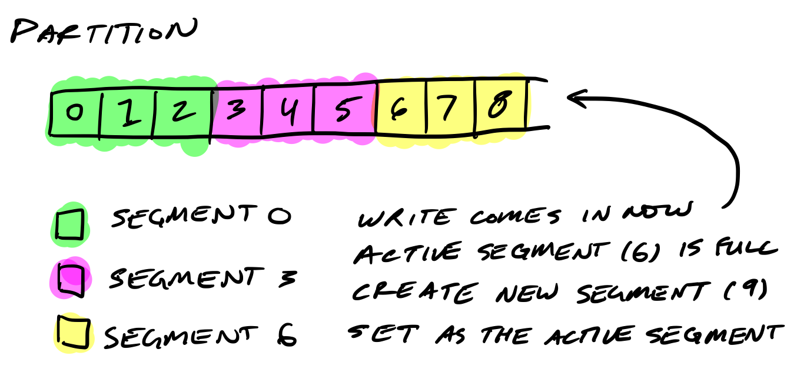
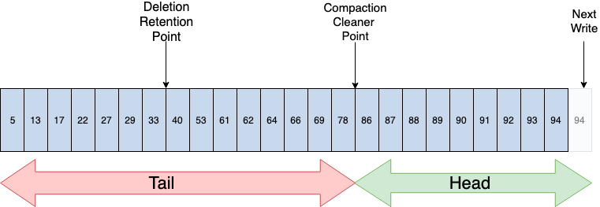
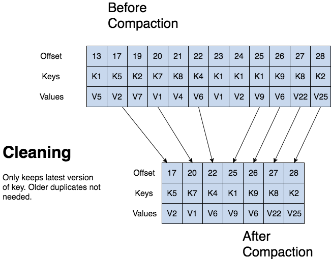

# 4장 카프카 상세 개념 설명

---

## 4.1 토픽과 파티션
> 토픽은 카프카의 가장 중요한 요소이다. 카프라를 사용하는 것은 토픽을 만들면서 시작되고 토픽을 삭제하면 데이터는 삭제되고 파이프라인이 중단된다.
데이터 생명주기 한가운데에 토픽이 있다.

### 4.1.1 적정 파티션 개수
토픽의 파티션 개수는 카프카의 성능과 관련이 있다. 

토픽 최초 생성 시 파티션의 개수 고려사항

- 데이터 처리량
- 메시지 키 사용 여부
- 브로커, 컨슈머 영향도

---

#### 데이터 처리량

파티션의 개수가 많아지면 1:1로 매핑되는 컨슈머 개수가 늘어난다. 파티션 개수를 정할 때는 해당 토픽에 필요한 데이터 처리량을 츨정하여 정하는 것이 중요하다.

#### 데이터 처리 속도를 올리는 방법
1. 컨슈머의 처리량을 늘린다.
   - 컨슈머가 실행되는 서버 스케일 업
   - GC 튜닝
   - 컨슈머의 특성상 다른 시스템(S3, 하둡, DB) 등과 연동되기 때문에 일정 수준 이상 처리량을 올리는 것은 매우 어렵다.
2. 컨슈머를 추가해서 병렬처리량을 늘린다.
   - **(권장) 프로듀서가 보내는 데이터양과 컨슈머의 데이터 처리량을 계산해서 파티션 개수를 정한다.** 
   - 프로듀서 보내는 데이터가 초당 1,000 레코드이고 컨슈머가 처리 가능한 데이터가 초당 100 레코드라면 필요한 파티션 개수는 10개이다. 
     - 파티션 개수 공식 : 프로듀서 전송 데이터량 < 컨슈머 데이터 처리량 x 파티션 개수
   - 파티션 개수 공식을 안지키면 컨슈머 랙이 생기고, 데이터 처리 지연이 발생하게 된다.
   - 파티션 개수를 늘리면 컨슈머, 브로커의 부담이 가중된다.

##### 컨슈머 데이터 처리량

- 상용에서 운영 중인 카프카에서 더미 데이터로 데스트를 해본다.
  - 컨슈머는 외부와 연동되기 때문에 테스트 환경에선 정확한 처리량을 구하기 힘들다.
- 카프카 컨슈머를 개발할 때 시간 복잡도를 줄이기 위한 다양한 방법을 시도한다.

##### 프로듀서 데이터 보내는 양

- 컨슈머 데이터 처리량을 구하고 난 뒤에는 프로듀서가 보내는 데이터양을 하루, 시간, 분 단위로 쪼개서 예측한다.
  - 데이터 지연이 발생해서는 안 된다면 **프로듀서가 보내는 데이터의 최대치를 데이터 생성량으로 잡고 계산한다.**
  - 데이터 지연이 발생해도 괜찮다면 프로듀서가 보내는 데이터양을 최대치로 잡지 않아도 된다. 
    - 컨슈머의 데이터 처리량보다 작을 때 컨슈머 랙이 줄어들기 때문이다.

----

#### 메시지 키 사용 여부
- 메시지 키를 사용함과 동시에 데이터 처리 순서를 지켜야 하는 경우에 대해 고려해야 한다.
- 기본 파티셔너를 사용하는 프로듀서의 경우 메시지 키를 사용하면 토픽으로 데이터를 보낼 때 메시지 키를 Hash로 변환하여 파티션에 매칭시킨다.
  - (주의) 만약 파티션 개수가 달라지면 이미 매칭된 파티션과 메시지 키의 매칭은 깨지고 랜덤한 파티션에 데이터가 할당된다. 
  - 컨슈머의 데이터 처리 순서가 중요하다면.. 
    - 커스텀 파티셔너를 개발
    - 파티션 개수를 프로듀서가 전송하는 데이터양보다 더 넉넉하게 잡고 생성하는 것이 좋다.

----

#### 브로커와 컨슈머의 영향도
- 파티션은 각 브로커의 파일 시스템을 사용하기 때문에 파티션이 늘어나는 만큼 브로커에서 접근하는 파일 개수가 많아진다.
  - OS 에서는 프로세스당 열 수 있는 파일 최대 개수를 제한하기 때문에 모니터링에 신경써야 한다.
- 파티션 개수가 이미 충분히 많다면 브로커 개수를 늘리는 방안도 고려해야 한다.

----

### 4.1.2 토픽 정리 정책 (cleanup.policy)

- 데이터를 더는 사용하지 않을 경우에는 cleanup.policy 옵션을 사용하여 데이터를 삭제할 수 있다.
  - delete : 완전 삭제
  - compact : 동일 메시지 키의 가장 오래된 데이터를 삭제

#### 토픽 삭제 정책
- 토픽을 운영하면 일반적으로 대부분 토픽의 cleanup.policy를 delete로 설정한다.
- 토픽의 데이터를 삭제할 때는 세그먼트 단위로 삭제를 진행한다.
- retention.ms는 토픽의 데이터를 유지하는 기간을 ms로 설정할 수 있다.
  - 카프카는 일정 주기마다 세그먼트 파일의 마지막 수정 시간과 retention.ms를 비교하는데, 세그먼트 마지막 수정 시간이 retention.ms을 넘어가면 세그먼트를 삭제한다.
  - retention.bytes는 토픽의 최대 데이터 크기를 제어한다. 이를 넘기면 세그먼트를 삭제하고 삭제된 데이터는 복구할 수 없다.

##### 세그먼트
> 카프카는 디스크에서 제거해야 하는 메시지를 정기적으로 찾아야 한다.  
> 매우 큰 단일 파일로 이뤄진 파티션 메시지는 해당 작업이 느리고 오류가 발생하기 쉽습니다. 이를 위해, 파티션은 세그먼트로 다시 분할된다.

- 세그먼트는 로그와 인덱스의 두 파일로 이뤄진다.
- 인덱스는 각 오프셋을 로그의 메시지 위치에 매핑하며 메시지를 조회하는 데 사용된다.
- 인덱스는 세그먼트의 기본 오프셋을 기준으로 오프셋을 저장합니다.
- 압축된 메시지 일괄 처리는 래퍼 메시지의 페이로드로 함께 래핑됩니다.
- 디스크에 저장된 데이터는 브로커가 네트워크를 통해 생산자로부터 수신하고 소비자에게 보내는 것과 동일합니다.

- 세그먼트는 토픽의 데이터를 저장하는 명시적인 파일 시스템 단윈이다.
- 세그먼트는 파티션마다 별개로 생성되며 파일 이름은 오프셋 중 가장 작은 값이 된다.
- 세그먼트는 다시 여러 조각으로 나뉘는데 segment.bytes 옵션으로 1개의 세그먼트 크기를 설정할 수 있다.
- 세그먼트가 옵션 값보다 커질 경우에 기존 적재하던 세그먼트 파일을 닫고 새로운 세그먼트를 열어서 데이터를 저장하는데, 데이터를 저장하기 위해 사용 중인 세그먼트를 액티브 세그먼트라 한다.

[출처:https://thehoard.blog/how-kafkas-storage-internals-work-3a29b02e026]

---

#### 토픽 압축 정책
<small>여기서 말하는 압축이란 메시지 키 별로 해당 메시지 키의 레코드 중 오래된 데이터를 삭제하는 정책을 뜻한다.</small>
> 로그 압축은 마지막 값을 유지하므로 최신 레코드의 전체 스냅샷을 인메모리 서비스, 영구 데이터 저장소 또는 캐시 다시 로드에 대한 시스템 오류 또는 충돌 후 상태를 복원하는 데 유용하다.

- 메시지 키를 기준으로 오래된 데이터를 삭제하기 때문에 삭제 정책과 다르게 1개 파티션에서 오프셋의 증가가 일정하지 않을 수 있다.
  - 즉, 1부터 10까지 오프셋이 있을 떄, 4,5,6 이 동일한 메시지 키를 가질 경우, 4,5번 오프셋의 레코드가 삭제될 수 있다.
- 토픽 압축 정책은 카프카 스트림즈의 KTable과 같이 메시지 키를 기반으로 데이터를 처리할 경우 유용하다.
- 압축 정책은 액티브 세그먼트를 제외한 나머지 세그먼트들에 한해서만 데이터를 처리한다.
- 압축 시작 시점은 min.cleanable.dirty.ratio 옵션값을 따른다.
  - 이 옵션값은 액티브를 제외한 나머지 세그먼트에 남아 있는 데이터의 테일(tail) 영역의 레코드 개수와 헤드 영역의 레코드 개수의 비율을 뜻한다.
  - 테일 영역은 압축이 완료된 레코드를 뜻하고, 테일 영역의 레코드들은 '클린 로그'라 부르며 압축이 완료됐기 때문에 테일 영역에는 중복된 메시지 키가 없다.
  - 헤드 영역의 레코드들은 '더티 로그'라 부르고 압축이 되기 전 레코드들이 이으므로 중복된 메시지 키를 가진 레코드가 존재한다.
  - dirty.ratio는 더티 영역의 메시지 개수를 압축 대상 세그먼트에 남아있는 데이터의 총 레코드 수 (더잍 영역 메시지 개수 + 클린 영역 메시지 개수)로 나눈 비율이다.
    - 더티 레코드 개수 / (클린 + 더티 레코드 개수) = 3 / (3/3), = 0.5
  - 옵션값을 0.9와 같이 크게 설정하면 압축 효과가 좋지만 압축 전까지는 많은 레코드가 용량을 차지하므로 용량 효율은 떨어진다.
  - 옵션값을 0.1과 같이 설정하면 계속해서 최신 데이터를 유지할 수 있다. 하지만 압축이 자주 발생하므로 브로커에 부담을 준다.

[출처:http://cloudurable.com/blog/kafka-architecture-log-compaction/index.html]

[출처:http://cloudurable.com/blog/kafka-architecture-log-compaction/index.html]

---

