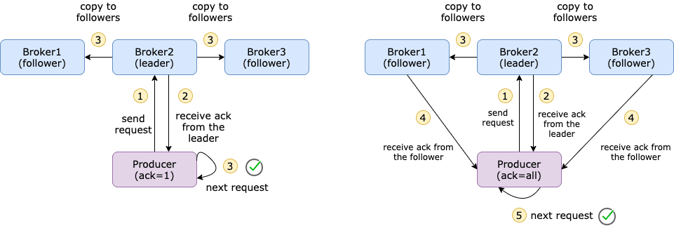
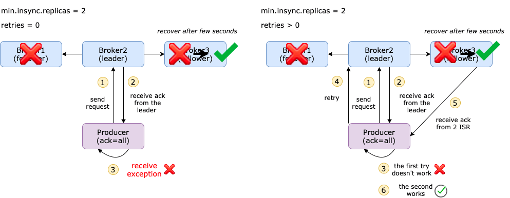
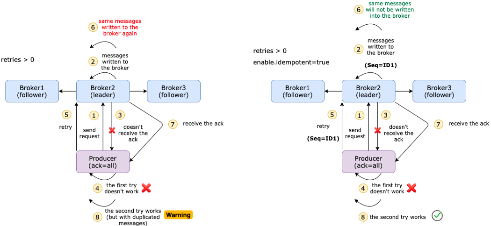
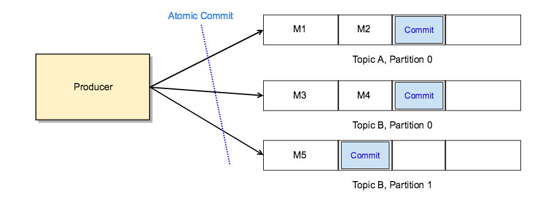
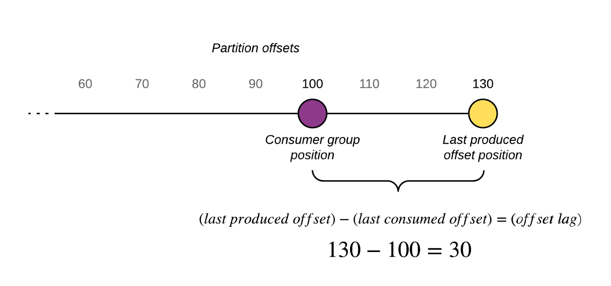
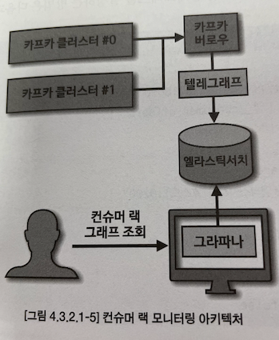

# 4장 카프카 상세 개념 설명

---

## 4.1 토픽과 파티션
> 토픽은 카프카의 가장 중요한 요소이다. 카프라를 사용하는 것은 토픽을 만들면서 시작되고 토픽을 삭제하면 데이터는 삭제되고 파이프라인이 중단된다.
데이터 생명주기 한가운데에 토픽이 있다.

### 4.1.1 적정 파티션 개수
토픽의 파티션 개수는 카프카의 성능과 관련이 있다. 

토픽 최초 생성 시 파티션의 개수 고려사항

- 데이터 처리량
- 메시지 키 사용 여부
- 브로커, 컨슈머 영향도

---

#### 데이터 처리량

파티션의 개수가 많아지면 1:1로 매핑되는 컨슈머 개수가 늘어난다. 파티션 개수를 정할 때는 해당 토픽에 필요한 데이터 처리량을 츨정하여 정하는 것이 중요하다.

#### 데이터 처리 속도를 올리는 방법
1. 컨슈머의 처리량을 늘린다.
   - 컨슈머가 실행되는 서버 스케일 업
   - GC 튜닝
   - 컨슈머의 특성상 다른 시스템(S3, 하둡, DB) 등과 연동되기 때문에 일정 수준 이상 처리량을 올리는 것은 매우 어렵다.
2. 컨슈머를 추가해서 병렬처리량을 늘린다.
   - **(권장) 프로듀서가 보내는 데이터양과 컨슈머의 데이터 처리량을 계산해서 파티션 개수를 정한다.** 
   - 프로듀서 보내는 데이터가 초당 1,000 레코드이고 컨슈머가 처리 가능한 데이터가 초당 100 레코드라면 필요한 파티션 개수는 10개이다. 
     - 파티션 개수 공식 : 프로듀서 전송 데이터량 < 컨슈머 데이터 처리량 x 파티션 개수
   - 파티션 개수 공식을 안지키면 컨슈머 랙이 생기고, 데이터 처리 지연이 발생하게 된다.
   - 파티션 개수를 늘리면 컨슈머, 브로커의 부담이 가중된다.

##### 컨슈머 데이터 처리량

- 상용에서 운영 중인 카프카에서 더미 데이터로 데스트를 해본다.
  - 컨슈머는 외부와 연동되기 때문에 테스트 환경에선 정확한 처리량을 구하기 힘들다.
- 카프카 컨슈머를 개발할 때 시간 복잡도를 줄이기 위한 다양한 방법을 시도한다.

##### 프로듀서 데이터 보내는 양

- 컨슈머 데이터 처리량을 구하고 난 뒤에는 프로듀서가 보내는 데이터양을 하루, 시간, 분 단위로 쪼개서 예측한다.
  - 데이터 지연이 발생해서는 안 된다면 **프로듀서가 보내는 데이터의 최대치를 데이터 생성량으로 잡고 계산한다.**
  - 데이터 지연이 발생해도 괜찮다면 프로듀서가 보내는 데이터양을 최대치로 잡지 않아도 된다. 
    - 컨슈머의 데이터 처리량보다 작을 때 컨슈머 랙이 줄어들기 때문이다.

----

#### 메시지 키 사용 여부
- 메시지 키를 사용함과 동시에 데이터 처리 순서를 지켜야 하는 경우에 대해 고려해야 한다.
- 기본 파티셔너를 사용하는 프로듀서의 경우 메시지 키를 사용하면 토픽으로 데이터를 보낼 때 메시지 키를 Hash로 변환하여 파티션에 매칭시킨다.
  - (주의) 만약 파티션 개수가 달라지면 이미 매칭된 파티션과 메시지 키의 매칭은 깨지고 랜덤한 파티션에 데이터가 할당된다. 
  - 컨슈머의 데이터 처리 순서가 중요하다면.. 
    - 커스텀 파티셔너를 개발
    - 파티션 개수를 프로듀서가 전송하는 데이터양보다 더 넉넉하게 잡고 생성하는 것이 좋다.

----

#### 브로커와 컨슈머의 영향도
- 파티션은 각 브로커의 파일 시스템을 사용하기 때문에 파티션이 늘어나는 만큼 브로커에서 접근하는 파일 개수가 많아진다.
  - OS 에서는 프로세스당 열 수 있는 파일 최대 개수를 제한하기 때문에 모니터링에 신경써야 한다.
- 파티션 개수가 이미 충분히 많다면 브로커 개수를 늘리는 방안도 고려해야 한다.

----

### 4.1.2 토픽 정리 정책 (cleanup.policy)

- 데이터를 더는 사용하지 않을 경우에는 cleanup.policy 옵션을 사용하여 데이터를 삭제할 수 있다.
  - delete : 완전 삭제
  - compact : 동일 메시지 키의 가장 오래된 데이터를 삭제

#### 토픽 삭제 정책
- 토픽을 운영하면 일반적으로 대부분 토픽의 cleanup.policy를 delete로 설정한다.
- 토픽의 데이터를 삭제할 때는 세그먼트 단위로 삭제를 진행한다.
- retention.ms는 토픽의 데이터를 유지하는 기간을 ms로 설정할 수 있다.
  - 카프카는 일정 주기마다 세그먼트 파일의 마지막 수정 시간과 retention.ms를 비교하는데, 세그먼트 마지막 수정 시간이 retention.ms을 넘어가면 세그먼트를 삭제한다.
  - retention.bytes는 토픽의 최대 데이터 크기를 제어한다. 이를 넘기면 세그먼트를 삭제하고 삭제된 데이터는 복구할 수 없다.


##### 세그먼트
> 카프카는 디스크에서 제거해야 하는 메시지를 정기적으로 찾아야 한다.  
> 매우 큰 단일 파일로 이뤄진 파티션 메시지는 해당 작업이 느리고 오류가 발생하기 쉽습니다. 이를 위해, 파티션은 세그먼트로 다시 분할된다.

- 세그먼트는 로그와 인덱스의 두 파일로 이뤄진다.
- 인덱스는 각 오프셋을 로그의 메시지 위치에 매핑하며 메시지를 조회하는 데 사용된다.
- 인덱스는 세그먼트의 기본 오프셋을 기준으로 오프셋을 저장합니다.
- 압축된 메시지 일괄 처리는 래퍼 메시지의 페이로드로 함께 래핑됩니다.
- 디스크에 저장된 데이터는 브로커가 네트워크를 통해 생산자로부터 수신하고 소비자에게 보내는 것과 동일합니다.


- 세그먼트는 토픽의 데이터를 저장하는 명시적인 파일 시스템 단윈이다.
- 세그먼트는 파티션마다 별개로 생성되며 파일 이름은 오프셋 중 가장 작은 값이 된다.
- 세그먼트는 다시 여러 조각으로 나뉘는데 segment.bytes 옵션으로 1개의 세그먼트 크기를 설정할 수 있다.
- 세그먼트가 옵션 값보다 커질 경우에 기존 적재하던 세그먼트 파일을 닫고 새로운 세그먼트를 열어서 데이터를 저장하는데, 데이터를 저장하기 위해 사용 중인 세그먼트를 액티브 세그먼트라 한다.


[출처:https://thehoard.blog/how-kafkas-storage-internals-work-3a29b02e026]

---

#### 토픽 압축 정책
<small>여기서 말하는 압축이란 메시지 키 별로 해당 메시지 키의 레코드 중 오래된 데이터를 삭제하는 정책을 뜻한다.</small>
> 로그 압축은 마지막 값을 유지하므로 최신 레코드의 전체 스냅샷을 인메모리 서비스, 영구 데이터 저장소 또는 캐시 다시 로드에 대한 시스템 오류 또는 충돌 후 상태를 복원하는 데 유용하다.

- 메시지 키를 기준으로 오래된 데이터를 삭제하기 때문에 삭제 정책과 다르게 1개 파티션에서 오프셋의 증가가 일정하지 않을 수 있다.
  - 즉, 1부터 10까지 오프셋이 있을 떄, 4,5,6 이 동일한 메시지 키를 가질 경우, 4,5번 오프셋의 레코드가 삭제될 수 있다.
- 토픽 압축 정책은 카프카 스트림즈의 KTable과 같이 메시지 키를 기반으로 데이터를 처리할 경우 유용하다.
- 압축 정책은 액티브 세그먼트를 제외한 나머지 세그먼트들에 한해서만 데이터를 처리한다.
- 압축 시작 시점은 min.cleanable.dirty.ratio 옵션값을 따른다.
  - 이 옵션값은 액티브를 제외한 나머지 세그먼트에 남아 있는 데이터의 테일(tail) 영역의 레코드 개수와 헤드 영역의 레코드 개수의 비율을 뜻한다.
  - 테일 영역은 압축이 완료된 레코드를 뜻하고, 테일 영역의 레코드들은 '클린 로그'라 부르며 압축이 완료됐기 때문에 테일 영역에는 중복된 메시지 키가 없다.
  - 헤드 영역의 레코드들은 '더티 로그'라 부르고 압축이 되기 전 레코드들이 이으므로 중복된 메시지 키를 가진 레코드가 존재한다.
  - dirty.ratio는 더티 영역의 메시지 개수를 압축 대상 세그먼트에 남아있는 데이터의 총 레코드 수 (더잍 영역 메시지 개수 + 클린 영역 메시지 개수)로 나눈 비율이다.
    - 더티 레코드 개수 / (클린 + 더티 레코드 개수) = 3 / (3/3), = 0.5
  - 옵션값을 0.9와 같이 크게 설정하면 압축 효과가 좋지만 압축 전까지는 많은 레코드가 용량을 차지하므로 용량 효율은 떨어진다.
  - 옵션값을 0.1과 같이 설정하면 계속해서 최신 데이터를 유지할 수 있다. 하지만 압축이 자주 발생하므로 브로커에 부담을 준다.


[출처:http://cloudurable.com/blog/kafka-architecture-log-compaction/index.html]


[출처:http://cloudurable.com/blog/kafka-architecture-log-compaction/index.html]

---

### 4.1.3 ISR (In-Sync-Replicas)
> ISR은 리더 파티션과 팔로워 파티션이 모두 싱크가 된 상태를 뜻한다.

- 팔로워 파티션이 리더 파티션으로부터 데이터를 복제하는 데에 시간이 걸리는데, 이로 인해 팔로워와 리더 파티션 간의 오프셋 차이가 발생한다. 
- replica.lag.time.max.ms 값을 설정하면 옵션값 주기를 가지고 팔로워 파티션이 데이터를 복제하는 확인한다.
  - 만약 팔로워 파티션이 옵션값보다 더 긴 시간 동안 데이터를 가져가지 않는다면 해당 팔로워에 문제가 생긴 것으로 판단하고 ISR 그룹에서 제외한다.
- ISR 그룹 안에 속하는 팔로워 파티션은 리더 파티션으로 선출될 자격을 가진다.
- 데이터 유실의 위험을 감수한다면 unclean.leader.election.enable 옵션에 true 값을 사용한다.
  - false 옵션값은 ISR이 아닌 팔로워 파티션을 리더로 선출하지 않으며, 리더 파티션이 존재하는 브로커가 다시 시작되기를 기다리기 때문에 토픽을 사용하는 서비스가 중단 될 수 있지만 데이터 유실은 없다.
  - true 옵션값은 ISR이 아닌 팔로워 파티션을 리더로 선출한다. 서비스 중단은 발생하지 않는다.
  - 옵션값은 서비스 운영 정책에 따라 달라지며, 해당 옵션은 토픽별로 설정할 수 있다.

```shell
$ bin/kafka-topics.sh --bootstrap-server my-kafka:9092 \
-- create --topic my-topic \
-- config unclean.leader.election.enable=false 
```

---

## 4.2 카프카 프로듀서 
> 카프카 클러스터는 3대 이상의 브로커로 이루어져 있어서 일부 브로커에 이슈가 생기더라도 데이터의 유실을 막을 수 있다. 그러나 유실을 막기 위해선 프로듀서에서 제공하는 다양한 옵션을 함께 사용해야 한다.

### 4.2.1 acks 옵션

acks옵션을 통해 프로듀서가 전송한 데이터가 카프카 클러스터에 얼마나 신뢰성 높게 저장할지 지정할 수 있다.
이 옵션에 따라 프로듀서의 성능이 달라질 수 있으므로 acks 옵션에 따른 카프카 동작 방식을 상세히 알고 설정해야 한다.

복제 개수가 1인 경우 acks 옵션에 따른 성능 변화는 크지 않다. 여기서는 복제 개수가 2 이상으로 운영하는 경우에 각 acks 별 동작 방식을 알아본다.

#### acks
- 0
  - 프로듀서가 리더 파티션으로 데이터를 전송했을 때 리더 파티션으로 데이터가 잘 저장되었는지 확인하지 않는다.
    - 리더 파티션은 데이터가 저장된 이후에 데이터가 몇 번째 오프셋에 저장되었는지 리턴한다. 이 때, acks 값이 0으로 설정되어 있다면 프로듀서는 리더 파티션에 데이터가 저장되었는지 여부에 대한 응답 값을 받지 않는다.
    - 프로듀서에는 데이터의 전송이 실패했을 때 재시도를 할 수 있도록 retries 옵션을 설정할 수 있는데, acks 값이 0이라면 retries옵션이 무의미하다.
  - 데이터 유실이 발생할 수 있지만, acks 값이 1 또는 all 로 했을 경우보다 훨씬 빠르다.
- 1
  - 프로듀서가 보낸 데이터가 리더 파티션에만 정상적으로 적재되었는지 확인한다.
    - 만약 정상적으로 데이터가 적재되지 않았다면 재시도를 할 수 있다. 
  - 리더 파티션에 적재가 완료되어 있어도 팔로워 파티션에는 데이터 동기화가 되지 않을 수 있는데, 이 때 동기화되지 않은 데이터가 유실이 발생할 수 있다.
- all or -1
  - 리더 파티션과 팔로워 파티션에 모두 정상적으로 데이터가 적재되었는지 확인한다.
  - acks=all 옵션값은 모든 리더 파티션과 팔로워 파티션의 적재를 뜻하는 것은 아니고 ISR에 포함된 파티션을 뜻하는 것이기 때문이다.
  - min.insync.replicas 옵션은 프로듀서가 리더 파티션과 팔로워 파티션에 데이터가 적재되었는지 확인하기 위한 최소 ISR 그룹의 파티션 개수이다.
    - min.insync.replicas = 1
      - ISR중 최소 1개 이상의 파티션에 데이터가 적재되었음을 확인하는 것이다. 이 경우 acks를 1로 했을 때와 같은 동작을 하는데, 이유는 ISR중 가장 처음 적재가 완료되는 파티션은 리더 파티션이기 때문이다.
    - min.insync.replicas = 2
      - 2로 설정했을 때부터 acks를 all로 설정하는 의미가 있다. 이 경우 ISR의 2개 이상의 파티션에 데이터가 정상 적재되었음을 확인한다는 뜻이다.
        - 리더 파티션 1개와 팔로워 파티션에 정상적으로 데이터가 적재되었음을 보장한다.
    - min.insync.replicas = 3
      - 카프카 브로커 복제 개수를 3으로 설정하면, 브로커 3대 중 1대에 이슈가 발생하여 동작하지 못하는 상황이 생기면 프로듀서는 데이터를 해당 토픽에 전송할 수 없다.
        - 왜냐하면 최소한으로 복제되어야 하는 파티션 개수가 3인데 팔로워 파티션이 위치할 브로커의 개수가 부족하기 떄문이다. 
        - NotEnoughReplicasException, NotEnoughReplicasAfterAppendException이 발생한다.
    - min.insync.replicas 옵션을 설정할 때 추가로 주의해야 할 점은 절대로 브로커 개수와 동일한 숫자로 설정하면 안되고 브로커 개수 미만으로 설정해야 한다.
      - 예를 들면 브로커 3대로 클러스터를 운영하면서 min.insync.replicas = 3 설정을 하는 경우 카프카 클러스터의 버전 업그레이드와 같은 상황이 발생하면 브로커는 롤링 다운 타임이 생기는데, 브로커가 1대라도 중단되면 프로듀서가 데이터를 추가할 수 없다.
    - 사용환경에서는 브로커를 3대 이상으로 묶고 토픽이 복제 개수는 3, min.insync.replicas = 2를 추천한다.


[출처: www.towardsdatascience.com]


[출처: www.towardsdatascience.com]

---

### 4.2.2 멱등성 (idempotence) 프로듀서

> 먁등성 프로듀서란 동일한 데이터를 여러 번 전송하더라도 카프카 클러스터에 단 한 번만 저장됨을 의미한다.

기본 프로듀서의 동작 방식은 적어도 한번 전달(at least once delivery)을 지원한다. 적어도 한번 전달이란 프로듀서가 클러스터에 데이터를 전송하여 저장할 때 적어도 한 번 이상 데이터를 적재할 수 있고 데이터가 유실되지 않음을 뜻한다. 다만 두 번 이상 적재할 가능성이 있으므로 데이터의 중복이 발생할 수 있다.

프로듀서가 보내는 데이터의 중복 적재를 막기 위해 프로듀서에서 enable.idempotence 옵션을 사용하여 정확히 한번 전달(exactly once delivery)을 지원한다.

```shell
enable.idempotent=true
```


1. 멱등성 프로듀서는 기본 프로듀서와 달리 데이터를 브로커로 전달할 때 프로듀서 PID(producer unique ID)와 시퀀스 넘버를 함께 전달한다.
2. 그러면 브로커는 프로듀서의 PID와 시퀀스 넘버를 확인하여 동일한 메시지의 적재 요청이 오더라도 단 한 번만 데이터를 적재함으로써 멱등성을 보장한다.
3. 단, 멱등성 프로듀서는 장애가 발생하지 않고 동일한 세션에서만 정확히 한번 전달을 보장한다. 동일한 세션이란 PID의 생명주기를 뜻한다.

멱등성 프로듀서를 사용하기 위해 enable.idempotence을 true로 설정했다면 정확히 한번 적재하는 로직이 성립되기 위해 일부 옵션들이 강제로 설정된다.

- 프로듀서의 데이터 재전송 횟수를 정하는 retries = Integer.MAX_VALUE
- acks = all 

정확히 한번 적재란 한번 전송을 뜻하는 것이 아닌 중복된 데이터를 적재하지 않는다는 뜻이다.

멱등성 프로듀서의 시퀀스 넘버는 0부터 시작하여 숫자를 1씩 더한 값이 전달되는데, 브로커가 예상한 시퀀스 넘버와 다른 번호의 요청이 온다면 OutOfOrderSequenceException(시퀀스 넘버 역전 형상)이 발생할 수 있다.



[출처: www.towardsdatascience.com]

---

### 4.2.3 트랜잭션(transaction) 프로듀서

> 다수의 파티션에 데이터를 저장할 경우 모든 데이터에 대해 동일한 원자성(atomic)을 만족시키기 위해 사용된다.

원자성 만족이란 다수의 데이터를 동일 트랜잭션으로 묶음으로써 전체 데이터를 처리하거나 처리하지 않도록 하는 것을 의미한다.

컨슈머가 트랜잭션으로 묶인 데이터를 브로커에서 가져갈 때는 기본 동작과 다르게 설정할 수 있다.


````shell
트랜잭션 프로듀서 설정
enable.idempotence=true
transactional.id='임의의 String 값'

컨슈머 설정
isolation.level=read_committed
````

위와 같이 설정하면 프로듀서와 컨슈머는 트랜잭션으로 처리 완료된 데이터만 쓰고 읽게 된다.

- 트랜잭션은 파티션의 레코드로 구분한다.
- 트랜잭션 프로듀서는 사용자가 보낸 데이터를 레코드로 파티션에 저장할 뿐만 아니라 트랜잭션의 시작과 끝을 표현하기 위해 트랜잭션 레코드를 1개 더 보낸다.
- 트랜잭션 컨슈머는 파티션에 저장된 트랜잭션 레코드를 보고 트랜잭션이 완료(commit)되었음을 확인하고 데이터를 가져간다.
- 트랜잭션 레코드는 실직적인 데이터는 가지고 있지 않으며 트랜잭션이 끝난 상태를 표시하는 정보만 가지고 있다. 대신 레코드의 특성은 그대로 가지고 있기 때문에 파티션에 저장되어 오프셋을 한 개 차지한다.


[출처:https://gunju-ko.github.io/kafka/2018/03/31/Kafka-Transaction.html]

- 트랜잭션 컨슈머는 커밋이 완료된 데이터가 파티션에 있을 경우에만 데이터를 가져간다. 만약 데이터만 존재하고 트랜잭션 레코드가 존재하지 않으면 아직 트랜잭션이 완료되지 않은 상태라고 판단하고 데이터를 가지고 가지 않는다.

---

## 4.3 카프카 컨슈머

> 컨슈머는 카프카에 적재된 데이터를 처리한다. 컨슈머를 통해 데이터를 카프카 클러스터로부터 가져가고 처리해야 한다.


### 4.3.1 멀티 스레드 컨슈머
파티션을 여러 개로 운영하는 경우 데이터를 병렬처리하기 위해서 파티션 개수와 컨슈머 개수를 동일하게 맞추는 것이 가장 좋은 방법이다.

- 토픽의 파티션은 1개 이상으로 이루어져 있으며 1개의 파티션은 1개 컨슈머가 할당되어 데이터를 처리할 수 있다.
- 파티션이 n개라면 동일 컨슈머 그룹으로 묶인 컨슈머 스레드를 최대 n개 운영할 수 있다.
  - n개의 스레드를 가진 1개의 프로세스를 운영하거나 1개의 스레드를 가진 프로세스를 n개 운영할 수 있다.

#### 멀티 스레드 컨슈머 고려사항
- 하나의 프로세스 내부에 스레드가 여러 개 생성되어 실행되기 때문에 하나의 컨슈머 스레드에서 예외적 상황(OutOfMemoryException)이 발생할 경우 프로세스 자체가 종료될 수 있고 이는 다른 컨슈머 스레드에까지 영향을 미칠 수 있다.
- 컨슈머 스레드들이 비정상적으로 종료될 경우 데이터 처리에서 중복 또는 유실이 발생할 수 있다.
- 각 컨슈머 스레드 간에 영향이 미치지 않도록 스레드 세이프 로직, 변수를 적용해야 한다.

고려할 점은 많지만, 멀티 스레드로 동작하는 멀티 컨슈머 스레드 애플리케이션을 안정적으로 지속 운영할 수 있도록 개발한다면 매우 효율적인 컨슈머 운영이 가능하다.

#### 멀티 스레드 운영 방식

##### **컨슈머 멀티 워커 스레드 전략**
> 컨슈머 스레드 1개, 데이터 처리를 담당하는 워커 스레드를 여러 개 실행하는 방식

- ExecutorService를 사용하면 레코드를 병렬처리하는 스레드를 효율적으로 생성하고 관리할 수 있다.
- Executors를 사용하여 스레드 풀을 생성할 수 있는데, 데이터 처리 환경에 맞는 스레드 풀을 사용할 수 있다.
- 작업 이후 스레드가 종료되어야 한다면 CachedThreadPool을 사용하여 스레드를 실행한다.

```java
//레코드가 출력하고 출력이 완료되면 스레드가 종료하도록 Executors.newCachedThreadPool() 
ExecutorService executorService = Executors.newCachedThreadPool();
```

- newCachedThreadPool은 필요한 만큼 스레드 풀을 늘려서 스레드를 실행하는 방식으로, 짧은 시간의 생명주기를 가진 스레드에서 유용하다.

```java
ConsumerRecords<String, String> records = consumer.poll(Duration.ofSeconds(10));
```

- poll() 메서드를 통해 리턴받은 레코드들을 처리하는 스레드를 레코드마다 개별 실행한다.

```shell
[pool-1-thread-1] INFO com.example.multiworker.ConsumerWorker - thread:pool-1-thread-1 	record:3
[pool-1-thread-2] INFO com.example.multiworker.ConsumerWorker - thread:pool-1-thread-2 	record:
[pool-1-thread-3] INFO com.example.multiworker.ConsumerWorker - thread:pool-1-thread-3 	record:213
[pool-1-thread-4] INFO com.example.multiworker.ConsumerWorker - thread:pool-1-thread-4 	record:12
[pool-1-thread-5] INFO com.example.multiworker.ConsumerWorker - thread:pool-1-thread-5 	record:312
[pool-1-thread-6] INFO com.example.multiworker.ConsumerWorker - thread:pool-1-thread-6 	record:321
[pool-1-thread-6] INFO com.example.multiworker.ConsumerWorker - thread:pool-1-thread-6 	record:31
```

주의사항
- 스레드를 사용함으로써 데이터 처리가 끝나지 않았음에도 불구하고 커밋을 하기 때문에 리밸런싱, 컨슈머 장애 시에 데이터 유실이 발생할 수 있다.
  - 각 레코드의 처리가 끝났음을 스레드로부터 리턴받지 않고 바로 poll() 메서드 호출한다.  
- 레코드 처리의 역전형상이다.
  - for 반복구문은 데이터 처리 순서를 보장하지만, 스레드는 순서를 보장할 수 없기에 운영환경에 대한 고려를 해야 한다.
  - 서버 리소스(CPU, 메모리 등) 모니터링 파이프라인, IOT 서비스의 센서 데이터 수집 파이프라인에 적합하다.

##### **컨슈머 멀티 스레드 전략**
> 컨슈머 인스턴스에 poll() 메서드를 호출하는 스레드를 여러 개 띄워서 사용한다.

하나의 파티션은 동일 컨슈머 중 최대 1개까지 할당된다. 그리고 하나의 컨슈머는 여러 파티션에 할당될 수 있다.

**이런 컨슈머 특징을 가장 잘 살리는 방법은 1개의 애플리케이션에 구독하고자 하는 토픽의 파티션 개수만큼 컨슈머 스레드 개수를 늘려서 운영하는 것이다.**

```shell
   토픽                애플리케이션
----------        ----------------
| 파티션 1 |  --->  | 컨슈머 스레드 1 |
----------        ----------------
| 파티션 2 |  --->  | 컨슈머 스레드 2 |
----------        ----------------  
| 파티션 3 |  --->  | 컨슈머 스레드 3 |  
----------        ----------------
```

여기서 주의할 점은 구독하고자 하는 토픽의 파티션 개수만큼만 컨슈머 스레드를 운영해야 한다.
- 컨슈머 스레드가 파티션 개수보다 많아지면 할당할 파티션 개수가 더는 없으므로 파티션에 할당되지 못한 컨슈머 스레드는 데이터를 처리하지 않게 된다.

````shell
[pool-1-thread-3] INFO com.example.multiconsumer.ConsumerWorker - threadName=consumer-thread-2, record=ConsumerRecord(topic = test, partition = 3, leaderEpoch = 0, offset = 7, CreateTime = 1661596820102, serialized key size = -1, serialized value size = 1, headers = RecordHeaders(headers = [], isReadOnly = false), key = null, value = 4)
[pool-1-thread-3] INFO com.example.multiconsumer.ConsumerWorker - threadName=consumer-thread-2, record=ConsumerRecord(topic = test, partition = 3, leaderEpoch = 0, offset = 8, CreateTime = 1661596820350, serialized key size = -1, serialized value size = 1, headers = RecordHeaders(headers = [], isReadOnly = false), key = null, value = 5)
[pool-1-thread-3] INFO com.example.multiconsumer.ConsumerWorker - threadName=consumer-thread-2, record=ConsumerRecord(topic = test, partition = 3, leaderEpoch = 0, offset = 9, CreateTime = 1661596820671, serialized key size = -1, serialized value size = 1, headers = RecordHeaders(headers = [], isReadOnly = false), key = null, value = 6)
````

--- 

### 4.3.2 컨슈머 랙(LAG)

> 토픽의 최신 오프셋(LOG-END-OFFSET)과 컨슈머 오프셋(CURRENT-OFFSET)간의 차이다. 컨슈머 랙은 컨슈머가 정상 동작하는지 여부를 확인할 수 있기 때문에 컨슈머 애플리케이션을 운영한다면 필수적으로 모니터링해야 하는 지표이다.



[출처: https://blog.devgenius.io/golang-kafka-101-extract-and-calculate-our-consumer-lag-40f902158948]

- 컨슈머 랙은 컨슈머 그룹과 토픽, 파티션별로 생성된다. 
  - 1개의 토픽에 3개의 파티션이 있고 1개의 컨슈머 그룹이 토픽을 구독하여 데이터를 가져가면 컨슈머 랙은 총 3개이다.
- 프로듀서가 보내는 데이터양이 컨슈머의 데이터 처리량보다 크다면 컨슈머 랙은 늘어난다.
  - 반대로 컨슈머 데이터 처리량이 프로듀서가 보내는 데이터양 보다 크다면 컨슈머 랙은 줄어들고 최소값은 0으로 지연 없음을 뜻한다.

컨슈머 랙 모니터링을 통해 컨슈머의 장애를 확인할 수 있고 파티션 개수를 정하는 데에 참고할 수 있다. 

1. 트래픽이 높은 날(추석, 설날, 이벤트데이)에 컨슈머 랙이 발생할 경우 지연을 줄이기 위해 일시적으로 파티션 개수와 컨슈머 개수를 늘려서 병렬처리량을 늘리는 방법이 있다.
2. 컨슈머의 장애로도 컨슈머 랙이 증가할 수도 있다.

#### 컨슈머 랙 확인 방법

컨슈머 랙을 확인하는 방법은 총 3가지가 있다. 
1. 카프카 명령어
2. 컨슈머 애플리케이션에서 metrics() 메서드
3. 외부 모니터링 툴

**카프카 명령어를 사용하여 컨슈머 랙 조회**  

- kafka-consumer-groups.sh 명령어를 사용하면 컨슈머 랙을 포함한 특정 컨슈머 그룹의 상태를 확인할 수 있다.

````shell
bin/kafka-consumer-groups.sh --bootstrap-server my-kafka:9092 --describe --group test-group


Consumer group 'test-group' has no active members.

GROUP           TOPIC           PARTITION  CURRENT-OFFSET  LOG-END-OFFSET  LAG             CONSUMER-ID     HOST            CLIENT-ID
test-group      test            1          3               3               0               -               -               -
test-group      test            0          9               9               0               -               -               -
test-group      test            3          10              10              0               -               -               -
test-group      test            2          1               1               0               -               -               -
test-group      test            4          5               5               0               -               -               -
````

이 방법은 일회성에 그치고 지표를 지속적으로 기록하고 모니터링하기에는 부족하다.

**컨슈머 metrics() 메서드를 사용하여 컨슈머 랙 조회**

```java
for (Map.Entry<MetricName, ? extends Metric> entry : consumer.metrics().entrySet()) {
    if ("record-lag-max".equals(entry.getKey().name()) |
        "record-lags".equals(entry.getKey().name())    |
        "record-lag-avg".equals(entry.getKey().name())) 
    {
        Metric metric = entry.getValue();
        log.info(entry.getKey().name(), metric.metricValue());
    }
}
```

이 방법은 3가지 문제가 있다.

1. 컨슈머가 정상 동작할 경우에만 확인 가능
2. 컨슈머 애플리케이션에 컨슈머 랙 모니터링 코드를 중복 작성
3. 컨슈머 랙을 모니터링하는 코드를 추가할 수 없는 카프카 서드 파티 애플리케이션의 컨슈머 랙 모니터링이 불가능

**외부 모니터링 툴을 사용하여 컨슈머 랙 조회**

- 데이터독
- 컨플루언트 컨트롤 센터
- 버로우(burrow)
  - 링크드인에서 개발하여 오픈소스로 공개한 컨슈머 랙 체크 툴 (REST API 방식)

외부 모니터링 툴을 사용하면 카프카 클러스터에 연결된 모든 컨슈머, 토픽들의 랙 정보를 한 번에 모니터링할 수 있다는 장점을 가진다.

또한, 모니터링 툴들은 클러스터와 연동되어 컨슈머의 데이터 처리와는 별개로 지표를 수집하기 때문에 데이터를 활용하는 프로듀서나 컨슈머의 동작에 영향을 미치지 않는다.


##### 버로우(Burrow)

버로우의 가장 큰 특징은 단순히 카프카 컨슈머 랙의 임계츠로 나타내지 않았다는 점이다.

~~~
MaxLag를 사용하지 않는 이유

표준 Kafka 소비자에는 MaxLag를 추적하는 기본 제공 메트릭이 있습니다. 이것이 편리할 수 있지만 다음과 같은 몇 가지 결함이 있습니다.

- MaxLag는 모든 소비자에서 모니터링되어야 합니다. MaxLag 메트릭은 모든 소비자에서 수집되어야 합니다. 이러한 메트릭은 별도로 대조되고 해석되어야 합니다.
- MaxLag는 소비자가 활성 상태일 때만 유효합니다. 메트릭은 소비자 자체에 의해 보고됩니다. 소비자가 실행 중이 아니면 사용할 수 있는 메트릭이 없습니다.
- MaxLag는 객관적이지 않습니다. 소비자 자체가 메트릭을 보고하기 때문에 MaxLag는 소비자 지연의 객관적인 측정이 될 수 없습니다. 소비자는 메시지를 가져온 후 이를 측정하므로 소비에 문제가 있는 경우 잘못된 값이 보고될 수 있습니다.
- MaxLag는 Java 클라이언트에서만 제공됩니다. 유일한 공식 Kafka 클라이언트는 Java 클라이언트이며 이 클라이언트는 사용 가능한 메트릭이 있는 유일한 클라이언트입니다. 확실히 다른 클라이언트에서 작동할 수 있지만 측정 및 메트릭 수집의 미묘한 차이에 대해 걱정해야 합니다.
~~~
[ref. https://github.com/linkedin/Burrow/wiki#why-not-maxlag] 

컨슈머 애플리케이션을 운영할 때 컨슈머 랙이 임계치에 도달할 때마다 알람을 받는 것은 무의미한 일이다. 그래서 **버로우는 임계치가 아닌 슬라이딩 윈도우 계산을 통해 문제가 생긴 파티션과 컨슈머의 상태를 표현한다.**

버로우에서 컨슈머 랙의 상태를 표현하는 것을 컨슈머 랙 평가라고 부른다. 컨슈머 랙과 파티션의 오프셋을 슬라이딩 윈도우로 계산하면 상태가 정해진다.

결과적으로 파티션의 상태를 OK, STALLED, STOPPED로 표현하고 컨슈머의 상태를 OK, WARING(데이터 처리량이 프로듀서가 보내는 데이터 양에 비해 적음), ERROR로 표현한다.

컨슈머 상태가 ERROR인 경우에는 파티션은 STALLED 상태가 되고 이 경우에는 컨슈머가 확실히 비정상적으로 동작하고 있으므로 이메일, SMS 등을 통해 즉각 알림받고 조치해야 한다.

##### 컨슈머 랙 모니터링 아키텍처

  
[출처: 아파치 카프카 애플리케이션 프로그래밍 with 자바]

---

### 4.3.3 컨슈머 배포 프로세스

#### 중단 배포
컨슈머 애플리케이션이 완전히 종료된 이후에 신규 애플리케이션이 배포되기 때문에 기존 컨슈머 애플리케이션이 종료되면 더는 토픽을 가져갈 수 없기 때문에 컨슈머 랙이 늘어난다.

컨슈머 랙의 증가로 인한 장애 전파가 될 수 있기 때문에 신뢰성 있는 배포 시스템을 가진 기업에서 사용하기 적절하다.

- 새로운 로직이 적용된 신규 애플리케이션의 실행 전후를 명확하게 특정 오프셋 지점으로 나눌 수 있다.
- 컨슈머 랙과 파티션별 오프셋을 기록하는 버로우를 사용하거나 배포 시점의 오프셋을 로깅한다면 배포 전후의 데이터를 명확히 구분할 수 있다.
- 롤백할 때 유용하다.


#### 무중단 배포

**블루/그린**
> 이전 버전 애플리케이션과 신규 버전 애플리케이션을 동시에 띄워놓고 트래픽을 전환하는 방법

- 이 방법은 파티션 개수와 컨슈머 개수를 동일하게 실행하는 애플리케이션을 운영할 때 유용하다.
  - 신규 버전을 배포하고 동일 컨슈머 그룹으로 파티션을 구독하도록 실행하면 신규 버전의 컨슈머들은 파티션을 할당 받지 못하고 유휴 상태로 기다릴 수 있기 때문이다.
  - 파티션 개수와 컨슈머 개수가 동일하지 않다면 일부 파티션은 기존 애플리케이션에 할당되고 일부는 신규 버전 애플리케이션에 할당되어 섞일 수 있다.

1. 신규 버전이 준비되면 기존 버전을 모두 중단한다.
2. 리밸런싱이 발생하면서 파티션은 모두 신규 컨슈머와 연동된다.
3. 블루/그린 배포는 리밸런스가 한 번만 발생하기에 많은 수의 파티션을 운영하는 경우에도 짧게 리밸런스 시간을 가져갈 수 있다.
  
**롤링**
> 블루/그린 배포의 인스턴스 할당과 반환으로 인한 리소스 낭비를 줄이면서 무중단 배포를 할 수 있다.

이 방법은 파티션 개수가 인스턴스 개수와 같거나 그보다 많아야 한다.

예를 들어, 파티션 2개로 운영하는 토픽을 롤링 배포 한다면 최소 2개의 인스턴스가 필요하다. 2개의 인스턴스 중 1개의 인스턴스를 신규 버전으로 실행하고 모니터링한 이후에 나머지 1개의 인스턴스도 신규 버전으로 배포한다.

리밸런스가 총 2번 발생하며, 파티션 개수가 많지 않을 때 효과적인 방법이다. 
 

**카나리**
> 데이터 중 일부분을 신규 버전의 애플리케이션에 먼저 배포함으로써 이슈가 없는지 사전 탐지할 수 있다.

예를 들어, 100개 파티션으로 운영하는 토픽이 있을 경우 1개의 파티션에 컨슈머를 따로 배정하여 일부 데이터를 신규 버전으로 전환 후 테스트 해보고 나머지 99개는 블루/그린 또는 롤링 배포를 수행하여 무중단 배포할 수 있다.

---


